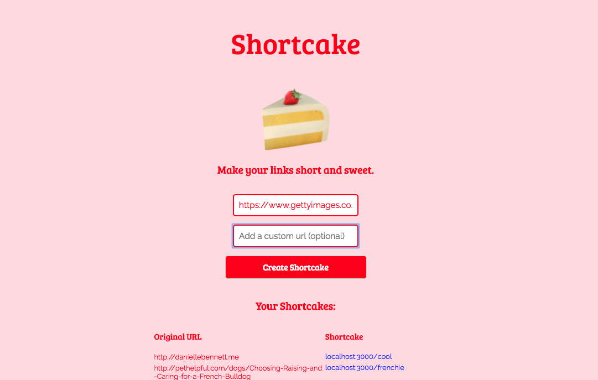

# Shortcake

An experiment in url shortening with React, ReactRouter, and Express.

## How to Run

1. Clone the repo
2. Change to the cloned directory from your terminal
3. Run ```PORT=3001 node bin/www``` to start the Express server on http://localhost:3001/
4. In a new terminal tab ```cd client```
4. Run ```npm start```
5. The app will run on http://localhost:3000/ by default
6. You can create redirect links and access from http://localhost:3000/(your-new-path) while the Express server is running


